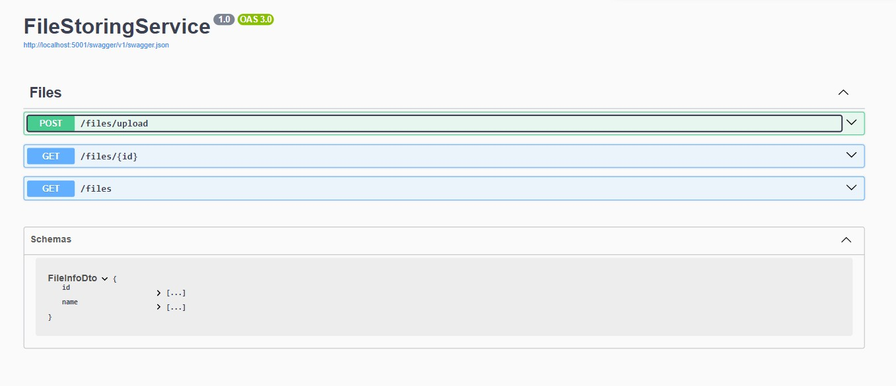
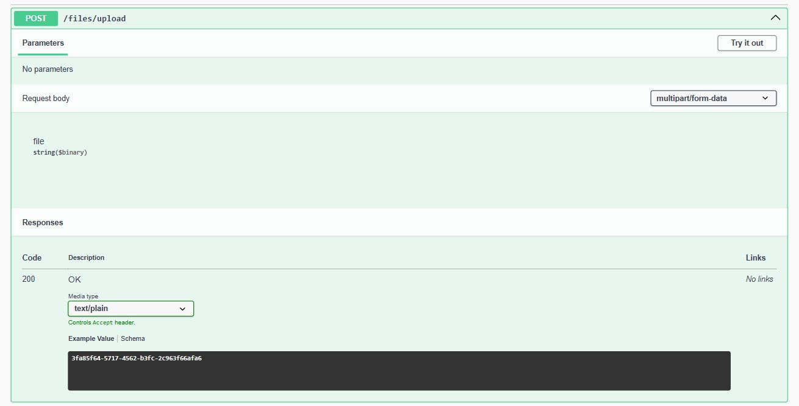
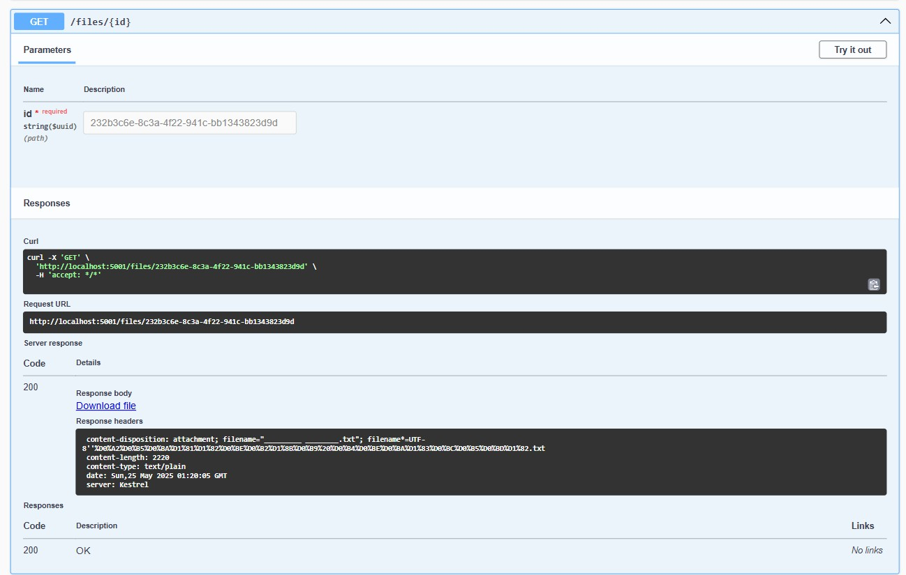
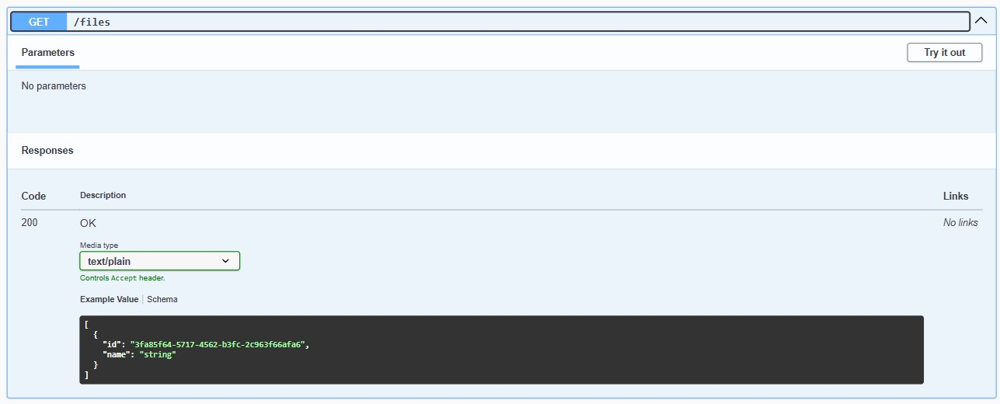
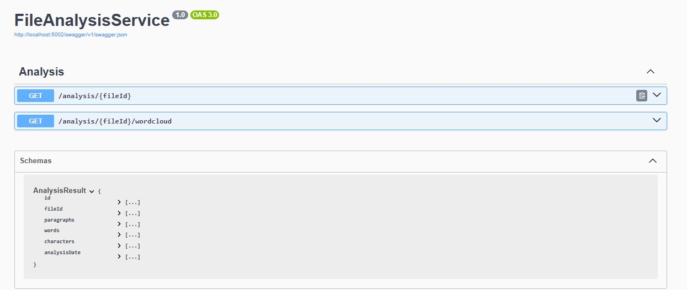
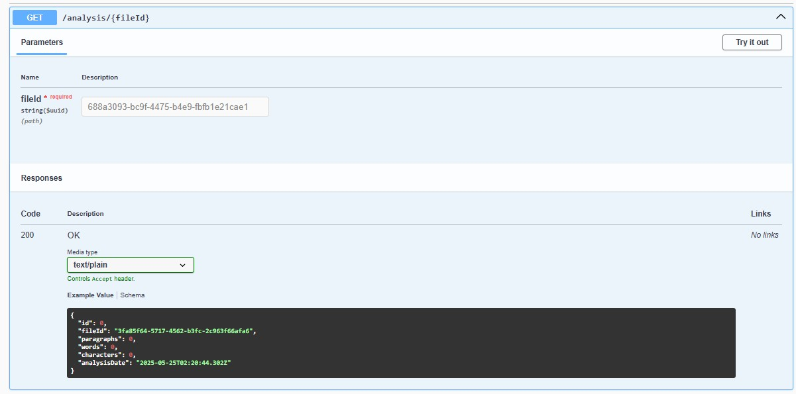
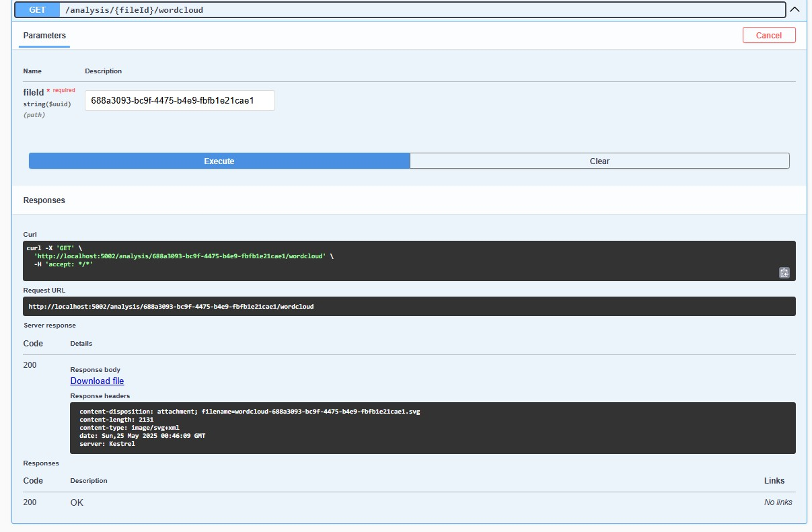
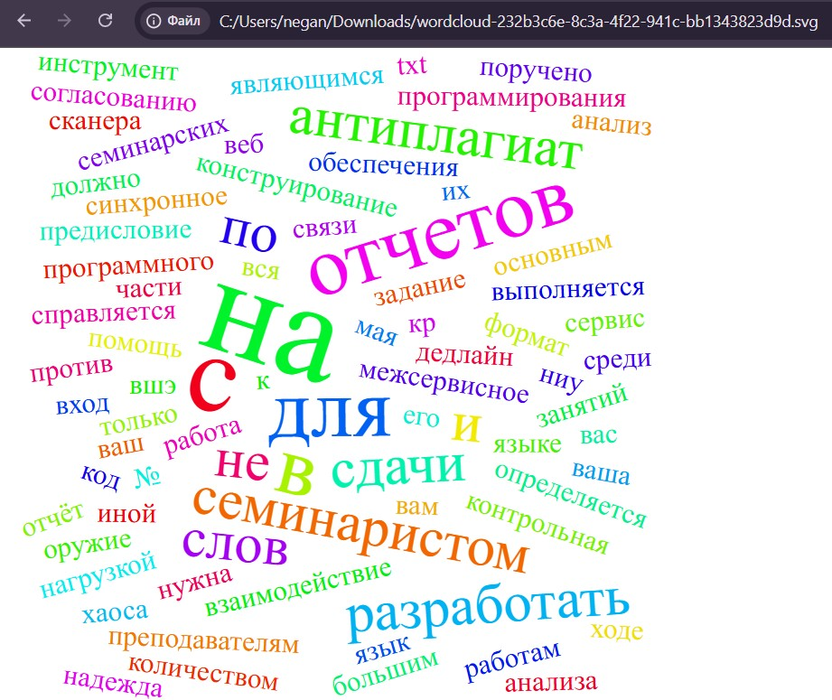

# Неганов Дмитрий Анатольевич, БПИ-238

## Описание

Проект представляет собой микросервисную архитектуру веб-приложения для загрузки, хранения и анализа .txt файлов.
Основной функционал:

* **FileStoringService** — загрузка и хранение файлов
* **FileAnalysisService** —  анализ текста (абзацы, слова, символы) и генерация облака слов (SVG)
* **ApiGateway** — единая точка входа, маршрутизация запросов к сервисам

Проверка на 100% плагиат по сравнению с ранее загруженными отчётами **игнорируется**, так как в системе считается, что
каждый файл уникален.
Это сделано для соответствия схеме. То есть, если хеш файла совпадает, то считается, что такой файл уже был загружен и
вернётся id уже существующего файла.

Все пользовательские сценарии соответствуют условию.

Каждый из сервисов запускается в своём контейнере. Для запуска всех контейнеров и базы данных испольузется docker-compose.yml. 
При старте контейнеров автоматически прогоняются миграции и проверяется состояние. У каждого из микросервисов своя бд.
Выстроено простое синхронное HTTP-взаимодействие через встроенный в Docker Compose сетевой DNS и API-шлюз.
Реализована обработка ошибок, в случае, если один из микросервисов упал. Реализация Swagger и тестирование с помощью него. 

---

## Структура проекта

```
HSEMicroservices/
├── ApiGateway/
├── FileStoringService/
├── FileAnalysisService/ 
├── docker-compose.yml 
├── .env
└── README.md
```

### ApiGateway

* **Program.cs** — настраивает YARP Reverse Proxy по маршрутам:

    * `/files/upload`, `/files/{id}` → FileStoringService
    * `/analysis/{id}` и `/analysis/{id}/wordcloud` → FileAnalysisService
* **appsettings.json** — конфигурация маршрутов и кластеров YARP
* **Dockerfile**             — сборка и запуск приложения в контейнере


### FileStoringService

* **Controllers/FilesController.cs**

    * `POST /files/upload` — загрузка файла; возвращает `GUID` (идентификатор)
    * `GET  /files/{id}`   — скачивание .txt файла
* **Data/AppDbContext.cs** — контекст для таблицы Files
* **Models/FileRecord.cs**  — модель записи файла (Id, Name, Hash, Location, UploadedAt)
* **Dockerfile**             — сборка и запуск приложения в контейнере

### FileAnalysisService

* **Controllers/AnalysisController.cs**

    * `GET /analysis/{id}`            —  анализ текста; возвращает объект `AnalysisResult` (Id, FileId,
      Paragraphs, Words, Characters, TextContent)
    * `GET /analysis/{id}/wordcloud`  — отдаёт SVG-облако слов с заголовками `Content-Type: image/svg+xml` и
      `Content-Disposition: attachment; filename="wordcloud-{id}.svg"` для скачивания
* **Data/AppDbContext.cs** — контекст для таблицы Analyses
* **Models/AnalysisResult.cs** — модель анализа (Id, FileId, Paragraphs, Words, Characters, TextContent, WordCloudSvg)
* **Dockerfile**             — сборка и запуск приложения в контейнере

---

## Настройка Docker и Docker Compose

1. Скопируйте файл `.env.example` в `.env` и заполните переменные:

   ```dotenv
    POSTGRES_HOST=postgres
    POSTGRES_USER=dima
    POSTGRES_PASSWORD=dima
    POSTGRES_DB_STORE=db_store
    POSTGRES_DB_ANALYSIS=db_analysis
    POSTGRES_PORT=5432
    
    FILE_SERVICE_URL=http://FileStoringService:8080
   ```

2. Структура `docker-compose.yml`:

    * **postgres** — образ PostgreSQL
    * **FileStoringService** — подключается к БД `db_store`, монтирует том `filedata` в `/app/StoredFiles`,
      слушает порт 8080 (проброс на 5001)
    * **FileAnalysisService** — подключается к БД `db_analysis`, зависит от FileStoringService, слушает 8080 (
      проброс на 5002)
    * **ApiGateway** — слушает 8080 (проброс на 5000), проксирует запросы на сервисы

3. Команда запуска:

   ```bash
   docker-compose up --build -d
   ```

---

## API

### FileStoringService
### http://localhost:5001/swagger/index.html






### FileAnalysisService
### http://localhost:5002/swagger/index.html




Облако слов можно скачать в формате svg и открыть прямо в браузере. Файл сохраняется в базе данных и возможны повторные запросы.

